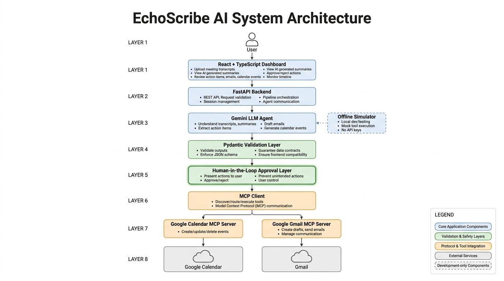

# EchoScribe AI | Human-in-the-Loop Meeting Agent

EchoScribe AI transforms raw meeting transcripts into structured summaries, action items, draft emails, and calendar events using Large Language Models (LLMs) and the Model Context Protocol (MCP).

Unlike conventional meeting assistants that directly execute actions, EchoScribe AI introduces explicit human approval checkpoints before interacting with external services. The objective is to build an AI agent that is reliable, observable, and safe enough for production environments where incorrect actions have real-world consequences.

---

## System Workflow

> **Figure 1:** End-to-end workflow from transcript ingestion to tool execution.

<p align="center">
  
</p>

---

## Problem Statement

Meeting transcription has become increasingly accurate. The real engineering challenge begins after transcription.

Transforming an unstructured conversation into reliable downstream actions requires the agent to correctly interpret context, identify actionable tasks, and safely interact with external systems such as Gmail and Google Calendar. Small misunderstandings can easily result in duplicate meetings, incorrect emails, or unintended actions.

Building production-ready AI agents therefore requires considerably more than accurate language generation. It requires structured outputs, deterministic execution, validation, and human oversight.

---

## Why Existing Approaches Fall Short

Most AI meeting assistants stop after generating summaries.

Systems that automatically execute actions often introduce several engineering challenges:

- Hallucinated or incorrect tool invocations
- Duplicate emails or calendar events during retries
- Inconsistent structured outputs that break downstream systems
- Limited visibility into agent decisions
- Reduced user trust due to autonomous execution

EchoScribe AI focuses on solving these reliability challenges rather than maximizing automation.

---

## Design Decisions

### Human-in-the-Loop Validation

Meeting transcripts are inherently noisy. Conversations frequently include hypothetical discussions, incomplete thoughts, jokes, and participants changing their minds mid-conversation.

Executing actions automatically could easily result in incorrect calendar events or emails being sent.

Every external action is therefore staged as a draft and requires explicit user approval before execution. This ensures users always retain final control while allowing the agent to automate repetitive workflows.

---

### Schema-Driven Structured Outputs

Large language models produce probabilistic outputs, making free-form responses unreliable for downstream systems.

The agent generates structured responses using Pydantic schemas, providing strict validation before data reaches the frontend or tool execution layer.

This guarantees consistent JSON formats while preventing malformed model outputs from propagating through the system.

---

### Idempotent Action Execution

Meeting transcripts are frequently reprocessed during retries, transcript edits, or development.

Without safeguards, duplicate calendar events or emails could easily be created.

Each generated action is assigned a deterministic hash, allowing previously processed actions to be identified and skipped, ensuring retries remain safe and free from duplicate side effects.

---

### Decoupled Frontend Architecture

The initial prototype was implemented using Streamlit. While useful for rapid prototyping, Streamlit reruns the application after every interaction, making multi-step approval workflows difficult to manage.

The architecture was redesigned using React and FastAPI, separating presentation from orchestration.

This provides predictable state management, a responsive user experience, and an architecture that scales more naturally toward production deployments.

---

### Tool Integration through Model Context Protocol (MCP)

Rather than integrating directly with Gmail or Google Calendar APIs, the system communicates with external services through the Model Context Protocol.

MCP provides a standardized interface between language models and external tools, allowing the orchestration layer to remain independent of specific service implementations.

This abstraction simplifies testing, improves maintainability, and makes it straightforward to extend the system with additional tools in the future.

---

## System Architecture

> **Figure 2:** High-level system architecture.

<p align="center">
  
</p>

---

## Evaluation

The project was evaluated using representative meeting transcripts to validate the reliability of the complete pipeline rather than only the language model outputs.

> **Figure 3:** Pipeline evaluation metrics.

<p align="center">
  
</p>

Example evaluation metrics:

| Metric | Result |
|---------|-------:|
| Structured Output Validation | 100% |
| Duplicate Action Prevention | 100% |
| Successful Tool Invocations | 100% |
| Invalid JSON Recovery | Supported |
| Offline Execution | Supported |
| Human Approval Layer | Enabled |

---

## Technology Stack

| Layer | Technologies |
|--------|--------------|
| Frontend | React, TypeScript, Vite |
| Backend | FastAPI |
| Agent Engine | Gemini (`google-genai`) |
| Validation | Pydantic |
| Tool Integration | Model Context Protocol (MCP) |
| Testing | Pytest |
| API | REST |

---

## Project Structure

```text
meeting-notes-agent/
├── README.md
├── requirements.txt
├── .env.example
├── config.py
├── schemas.py
├── agent.py
├── orchestrator.py
├── server.py
├── mcp_client.py
├── mcp_tools.py
├── main.py
├── frontend/
└── tests/
```

---

## Key Features

- Human-in-the-loop approval before external tool execution
- Structured LLM outputs validated through Pydantic schemas
- Model Context Protocol (MCP) integration for Gmail and Google Calendar
- React dashboard for reviewing generated actions before execution
- FastAPI backend exposing REST endpoints
- Offline simulation mode for local development and testing
- Deterministic hashing for idempotent execution
- Modular architecture separating orchestration, validation, frontend, and tool integrations

---

## Key Engineering Takeaways

This project demonstrates several production-oriented AI engineering principles:

- Designing AI systems around validation rather than unconstrained generation.
- Introducing human approval before irreversible external side effects.
- Enforcing schema validation to improve downstream reliability.
- Using deterministic execution to eliminate duplicate operations.
- Decoupling orchestration from external services through standardized tool interfaces.
- Building modular systems that support both online inference and offline development.

---

## Potential Extensions

The current architecture is modular and can be extended without significant changes to the orchestration pipeline. Possible enhancements include:

| Feature | Description |
|----------|-------------|
| Multi-Agent Collaboration | Introduce specialized agents for summarization, task extraction, email drafting, and scheduling coordinated by a supervisor agent. |
| Long-Term Memory | Store historical meetings to enable contextual follow-ups, recurring action tracking, and personalized meeting summaries. |
| Retrieval-Augmented Generation (RAG) | Retrieve previous meeting notes, project documentation, or company knowledge to generate context-aware summaries and recommendations. |
| Multi-Provider Calendar Support | Extend MCP integrations to Microsoft Outlook, Apple Calendar, and enterprise scheduling systems. |
| Additional Productivity Tools | Connect with Slack, Microsoft Teams, Jira, Linear, Notion, Trello, and Asana through additional MCP servers. |
| Conflict-Aware Scheduling | Detect scheduling conflicts and recommend alternative meeting times before creating calendar events. |
| Meeting Analytics | Generate insights such as participation metrics, recurring discussion topics, action completion rates, and meeting effectiveness trends. |
| Speaker Identification | Associate action items and decisions with individual participants using speaker diarization. |
| Notification & Reminder System | Automatically send reminders for pending action items and upcoming meetings. |
| Agent Observability | Integrate execution tracing, latency metrics, and decision auditing using LangSmith or OpenTelemetry. |
| Deployment Support | Containerize the application using Docker and deploy scalable services on Kubernetes. |
| Authentication & Multi-Tenancy | Support multiple users, organizations, and isolated workspaces with secure authentication and authorization. |
